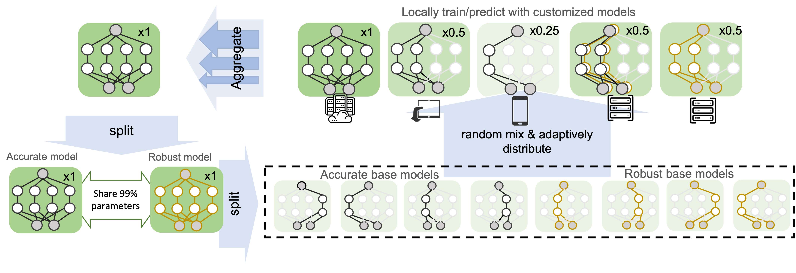

Split-Mix Federated Learning for Model Customization
====================================================

[](https://opensource.org/licenses/MIT)

Official PyTorch Code for Paper: "Efficient Split-Mix Federated Learning for On-Demand and In-Situ 
Customization" [Junyuan Hong](https://jyhong.gitlab.io/), [Haotao Wang](https://htwang14.github.io/),
[Zhangyang Wang](https://vita-group.github.io/) and [Jiayu Zhou](https://jiayuzhou.github.io/),
*ICLR* 2022. 

[paper](https://openreview.net/pdf?id=_QLmakITKg) / [code](https://github.com/illidanlab/SplitMix) / [slides](https://jyhong.gitlab.io/publication/split_mix/slides.pdf) / [blog](https://jyhong.gitlab.io/publication/split_mix/)


**TL;DR** Split-Mix is an efficient and flexible Federated Learning algorithm allowing customizing model
sizes and robustness during both training and testing time.

## Overview



Federated learning (FL) provides a distributed learning framework for multiple participants to 
collaborate learning without sharing raw data. In many practical FL scenarios, participants have 
heterogeneous resources due to disparities in hardware and inference dynamics that require quickly 
loading models of different sizes and levels of robustness. The heterogeneity and dynamics 
together impose significant challenges to existing FL approaches and thus greatly limit FL's 
applicability. In this paper, we propose a novel Split-Mix FL strategy for heterogeneous 
participants that, once training is done, provides *in-situ customization* of model sizes and 
robustness. Specifically, we achieve customization by learning a set of base sub-networks of 
different sizes and robustness levels, which are later aggregated on-demand according to inference 
requirements. This split-mix strategy achieves customization with high efficiency in communication, 
storage, and inference. Extensive experiments demonstrate that our method provides better in-situ 
customization than the existing heterogeneous-architecture FL methods.

## Usage

**Preparation**:
1. *Package dependencies*: Use `conda env create -f environment.yml` to create a conda env and
activate by `conda activate splitmix`. Major dependencies include
`pytorch, torchvision, wandb, numpy, thop` for model size customization, and `advertorch`
for adversarial training.
2. *Data*: Set up your paths to data in [utils/config.py](utils/config.py). Refer to 
[FedBN](https://github.com/med-air/FedBN#dataset--pretrained-modeel) for details of Digits and 
DomainNet datasets.
   * Cifar10: Auto download by `python -m utils.data_utils --download=Cifar10`.
   * Digits: Download the [FedBN Digits zip file](https://drive.google.com/file/d/1moBE_ASD5vIOaU8ZHm_Nsj0KAfX5T0Sf/view?usp=sharing) to `DATA_PATHS['Digits']'` 
   defined in `utils.config`.  Unzip all files.
   * DomainNet: Download the [FedBN DomainNet split file](https://drive.google.com/file/d/1_dx2-YDdvnNlQ13DTgDnLoGvMZvMyccR/view?usp=sharing) to `DATA_PATHS['DomainNetPathList']` 
   defined in `utils.config`. Download [Clipart](http://csr.bu.edu/ftp/visda/2019/multi-source/groundtruth/clipart.zip),
   [Infograph](http://csr.bu.edu/ftp/visda/2019/multi-source/infograph.zip),
   [Painting](http://csr.bu.edu/ftp/visda/2019/multi-source/groundtruth/painting.zip), 
   [Quickdraw](http://csr.bu.edu/ftp/visda/2019/multi-source/quickdraw.zip), 
   [Real](http://csr.bu.edu/ftp/visda/2019/multi-source/real.zip), 
   [Sketch](http://csr.bu.edu/ftp/visda/2019/multi-source/sketch.zip), put under 
   `DATA_PATH['DomainNet']` directory. Unzip all files.

**Train and test**:
1. *Customize model sizes*: Set `--data` to be one of `Digits`, `DomainNet`, `Cifar10`.
    ```shell
    # SplitMix
    python fed_splitmix.py --data Digits --no_track_stat # train
    python fed_splitmix.py --data Digits --no_track_stat --test --test_slim_ratio=0.25 # test
    # FedAvg
    python fedavg.py --data Digits --width_scale=0.125 --no_track_stat # train
    python fedavg.py --data Digits --width_scale=0.125 --no_track_stat --test # test
    # SHeteroFL
    python fed_hfl.py --data Digits --no_track_stat # train
    python fed_hfl.py --data Digits --no_track_stat --test --test_slim_ratio=0.25 # test
    ```
2. Customize robustness and model sizes (during training and testing)
   ```shell
   # SplitMix + DAT
   python fed_splitmix.py --adv_lmbd=0.5
   python fed_splitmix.py --adv_lmbd=0.5 --test --test_noise=LinfPGD --test_adv_lmbd=0.1  # robust test
   python fed_splitmix.py --adv_lmbd=0.5 --test --test_noise=none --test_adv_lmbd=0.1  # standard test
   # individual FedAvg + AT
   python fedavg.py --adv_lmbd=0.5
   python fed_splitmix.py --adv_lmbd=0.5 --test --test_noise=LinfPGD  # robust test
   python fed_splitmix.py --adv_lmbd=0.5 --test --test_noise=none  # standard test
   ```

For `fed_splitmix`, you may use `--verbose=1` to print more information and `--val_ens_only` to
speed up evaluation by only evaluating widest models.

## Reproduce Results

We provide detailed parameter settings in [sweeps](sweeps). Check [sweeps/Slimmable.md](sweeps/Slimmable.md)
for experiments of customizing model sizes. Check [sweeps/AT.md](sweeps/AT.md) for customizing
robustness and joint customization of robustness and model sizes. Example use of sweep:
```
~> wandb sweep sweeps/fed_niid/digits.yaml
wandb: Creating sweep from: sweeps/fed_niid/digits.yaml
wandb: Created sweep with ID: <ID>
wandb: View sweep at: https://wandb.ai/<unique ID>
wandb: Run sweep agent with: wandb agent <unique ID>
~> export CUDA_VISIBLE_DEVICES=0  # choose desired GPU
~> wandb agent <unique ID>
```

Pre-trained models will be shared upon request.

## Citation

```bibtex
@inproceedings{hong2022efficient,
  title={Efficient Split-Mix Federated Learning for On-Demand and In-Situ Customization},
  author={Hong, Junyuan and Wang, Haotao and Wang, Zhangyang and Zhou, Jiayu},
  booktitle={ICLR},
  year={2022}
}
```

## Acknowledgement

This material is based in part upon work supported by the National Institute of Aging 1RF1AG072449, 
Office of Naval Research N00014-20-1-2382, National Science Foundation under Grant IIS-1749940. 
Z. W. is supported by the U.S. Army Research Laboratory Cooperative Research Agreement 
W911NF17-2-0196 (IOBT REIGN).
